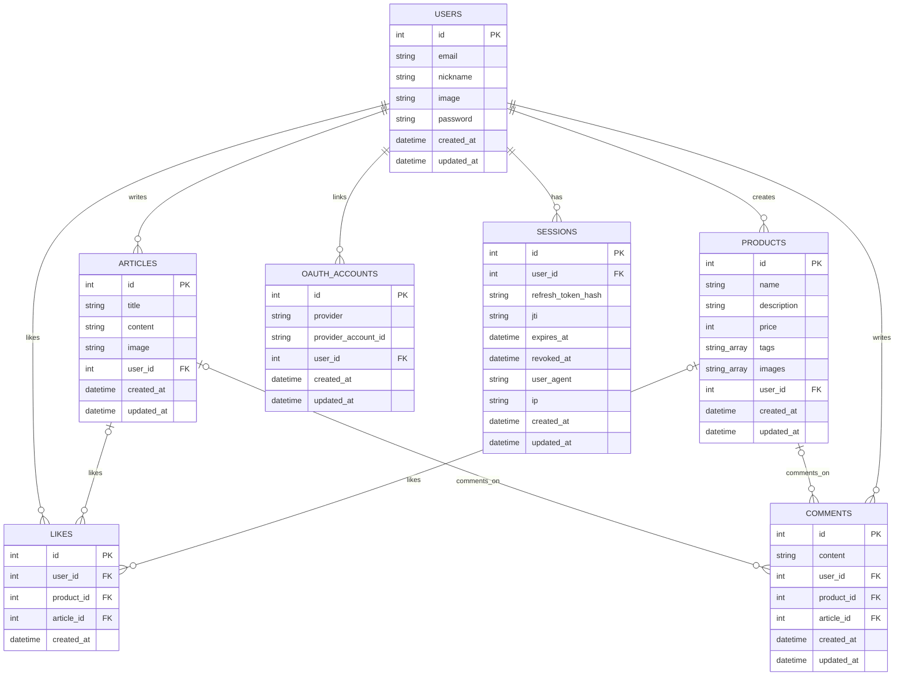

```mermaid

erDiagram

  USERS {
    int id PK
    string email
    string nickname
    string image
    string password
    datetime created_at
    datetime updated_at
  }

  PRODUCTS {
    int id PK
    string name
    string description
    int price
    string_array tags
    string_array images
    int user_id FK
    datetime created_at
    datetime updated_at
  }

  ARTICLES {
    int id PK
    string title
    string content
    string image
    int user_id FK
    datetime created_at
    datetime updated_at
  }

  COMMENTS {
    int id PK
    string content
    int user_id FK
    int product_id FK
    int article_id FK
    datetime created_at
    datetime updated_at
  }

  LIKES {
    int id PK
    int user_id FK
    int product_id FK
    int article_id FK
    datetime created_at
  }

  OAUTH_ACCOUNTS {
    int id PK
    string provider
    string provider_account_id
    int user_id FK
    datetime created_at
    datetime updated_at
  }

  SESSIONS {
    int id PK
    int user_id FK
    string refresh_token_hash
    string jti
    datetime expires_at
    datetime revoked_at
    string user_agent
    string ip
    datetime created_at
    datetime updated_at
  }

  USERS ||--o{ ARTICLES : writes
  USERS ||--o{ PRODUCTS : creates
  USERS ||--o{ COMMENTS : writes
  PRODUCTS o|--o{ LIKES : likes
  ARTICLES o|--o{ LIKES : likes
  USERS ||--o{ LIKES : likes
  USERS ||--o{ OAUTH_ACCOUNTS : links
  USERS ||--o{ SESSIONS : has
  PRODUCTS o|--o{ COMMENTS : comments_on
  ARTICLES o|--o{ COMMENTS : comments_on

```
